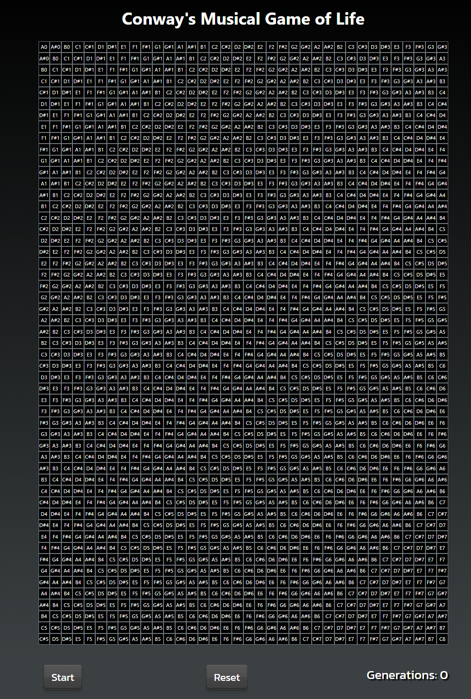

# Conway's Musical Game of Life

This project is an implementation of Conway's Game of Life that generates musical notes for each alive cell. It features multiple synthesizers and playback types to create a variety of sounds from the cells. The tuning system of the Harpejji is used to assign notes to each cell. So starting in the top left corner moving right is a half-step    of a note and moving down a row it moves a whole-step.



## Run Commands

1. Install all the necessary npm packages:
    ```bash
    npm install
    ```
2. Run the development version:
    ```bash
    npm run dev
    ```
## Firebase Deployment
1. Build the project
   ```bash
   npm run build
   ```
2. Deploy to firebase
   ```bash
   firebase deploy
   ```

